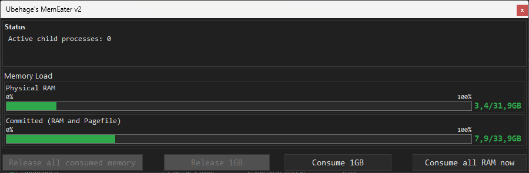
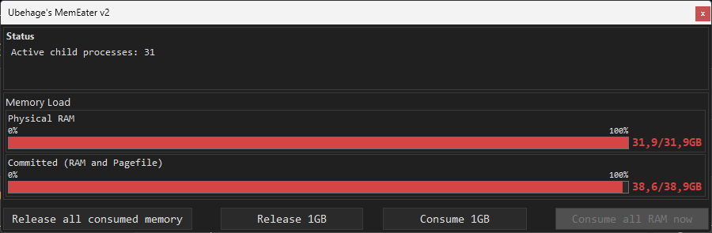

# MemEater v2  

MemEater is a lightweight, portable utility for stress-testing Windows memory handling.  
It is designed to intentionally overload system memory, allowing users and developers to observe how Windows behaves under low-memory conditions.

## Features

- **Portable and Lightweight:** No installation or dependencies required—just run the executable.
- **Built with Visual Basic 6:** 100% native, no .NET or runtime requirements.
- **Custom Memory Load:** 
  - Consume all available memory in one click.
  - Consume memory in 1GB increments.
  - Consume an arbitrary number of GB at once via the "Consume Multiple GB..." dialog.
  - Release memory in 1GB decrements.
  - Instantly release all consumed memory.
- **Real-Time Stats:** 
  - Displays physical RAM and committed memory usage.
  - Shows number of active memory-consuming child processes.
- **Safe to Use:** All memory can be released with a single click.

## Intended Use

MemEater is intended for:
- Developers and IT professionals who need to test how their applications or systems behave under memory pressure.
- Stress-testing Windows memory management, paging, and stability.
- Educational purposes and controlled experiments.

**Warning:** Running MemEater will intentionally make your system unstable or unresponsive by consuming large amounts of memory.  
Use with caution and save your work before starting any test.

## Screenshots

### Normal Memory Usage

### Memory Fully Consumed (Stress Test)

## Usage

1. Download and run the executable on a modern Windows system.
2. Use the buttons to:
    - **Consume 1GB:** Gradually increase memory usage.
    - **Consume all RAM now:** Instantly allocate as much RAM as possible.
    - **Release all consumed memory:** Frees all memory used by MemEater.
3. Observe system behavior and memory stats in real time.

## License

This project is licensed under the MIT License. See [LICENSE](LICENSE) for details.

---

> **Disclaimer:**  
> MemEater is provided as-is, with no guarantee of fitness for any particular purpose. The author is not responsible for any data loss or system instability caused by its use. Use at your own risk.